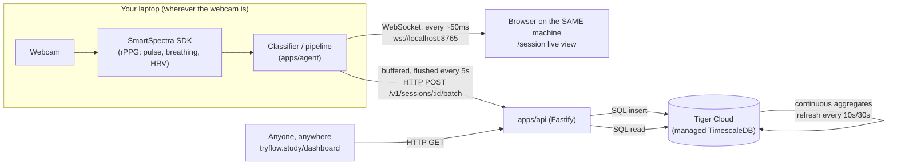
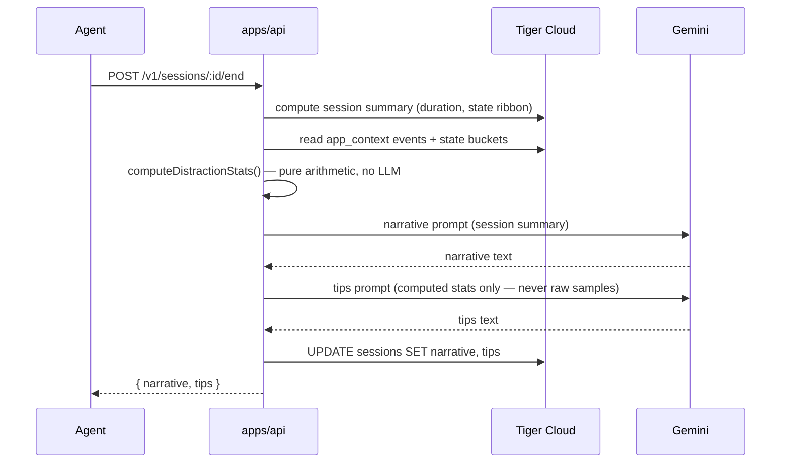
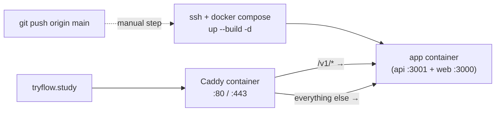

# Flow

A webcam-based focus and physiology coach. During a work session it reads pulse, breathing, blink rate and gaze off a plain webcam, cross-references that against what's on screen, and names states no timer can see — including "eyes on the page, brain gone." It intervenes live with voice-guided breathing and writes a plain-language account of the session afterward, with AI-generated tips for next time.

Live: **https://tryflow.study**

---

## Contents

- [Quick start](#quick-start)
- [Tech stack](#tech-stack)
- [How the pieces fit together](#how-the-pieces-fit-together)
- [Data flow](#data-flow)
- [Database schema (ERD)](#database-schema-erd)
- [Deployment](#deployment)
- [Repo layout](#repo-layout)

---

## Quick start

### Clone and install

```bash
git clone https://github.com/johnwfan/flow.git
cd flow
pnpm install
```

Requires Node 20+, pnpm 9 (`corepack enable` will pick up the pinned version from `package.json`), and a webcam if you want real sensing rather than mock data.

### Configure environment

Copy `.env.example` to `.env` at the repo root and fill in:

| Variable | Used by | Required? |
|---|---|---|
| `TIGER_CLOUD_URL` | api | Yes — api won't boot without it |
| `GEMINI_API_KEY` | api | No — narratives/tips fall back to canned text without it |
| `ELEVENLABS_API_KEY` / `ELEVENLABS_VOICE_ID` | api | No — `/v1/speak` degrades gracefully without it |
| `NEXT_PUBLIC_API_BASE_URL` | web | No — defaults to same-origin in production, `localhost:3001` in dev |
| `NEXT_PUBLIC_AGENT_WS_URL` | web | No — defaults to `ws://localhost:8765` |

The **agent** reads its own env file at `apps/agent/.env` (not the root one) — see `apps/agent/.env.example`. Its key setting is `API_BASE_URL`: point it at `http://localhost:3001` for local dev, or `https://tryflow.study` to have a locally-run agent (camera sensing only ever runs locally — see below) persist straight to the live public dashboard.

Run `pnpm check:env` any time to confirm what's actually set, without printing values.

### Run it

```bash
pnpm dev:all      # starts api (:3001) + web (:3000)
run.bat           # separately: the real-webcam agent (Windows; opens the live session page for you)
```

`pnpm dev:all` deliberately does **not** start the agent — it binds a real camera via a native SDK and has to run on whichever machine has the webcam, not wherever the API happens to be. See `docs/RUNNING.md` for the full dev/demo runbook and `pnpm smoke` for a pre-demo sanity check.

---

## Tech stack

| Layer | Stack |
|---|---|
| Sensing agent | Node.js + TypeScript (`tsx`), [`@smartspectra/node-sdk`](https://presagetech.com) for camera-based rPPG (pulse/breathing/HRV from video, no wearable), `ws` for its own local WebSocket server |
| API | [Fastify](https://fastify.dev) 5, `pg` (node-postgres), Google Gemini (`generativelanguage.googleapis.com`) for narratives/tips, ElevenLabs for TTS |
| Database | **Tiger Cloud** — Timescale's managed TimescaleDB (Postgres + hypertables + continuous aggregates) |
| Web | Next.js 14 (App Router), React 18, Tailwind (legacy utility classes now mapped onto the design-token CSS variables), a hand-built oklch-token design system, Recharts for a couple of chart types |
| Shared | One `packages/shared` TypeScript package — the frozen WebSocket message contract used by both the agent and the web client |
| Infra | Docker Compose on a Vultr VM, [Caddy](https://caddyserver.com) as reverse proxy + automatic HTTPS (Let's Encrypt) for `tryflow.study` |
| Monorepo | pnpm workspaces + [Turborepo](https://turbo.build) |

---

## How the pieces fit together

Four independently-runnable pieces:

- **`apps/agent`** — the only piece that touches the camera. Runs on whoever's laptop is being used to study. Does the actual rPPG sensing, classification (`focused` / `zoned_out` / `spiraling` / `warmup` / `no_signal`), and talks to the outside world two ways (see [Data flow](#data-flow)).
- **`apps/api`** — a stateless Fastify server. Ingests batched data from the agent, serves it back out to the web app, and owns the two AI call-outs (Gemini for narrative/tips, ElevenLabs for speech).
- **`apps/web`** — the Next.js dashboard. A `(marketing)` route group holds the public landing page at `/`; an `(app)` route group holds the actual product behind a persistent sidebar (`Session`, `Sessions`, `Insights`, `Validation`).
- **`packages/shared`** — the `WsMessage` union type both the agent and `apps/web/.../session` import, so the live-view contract can't silently drift between them.

**Tiger Cloud is not "inside" Vultr.** It's a separately-hosted managed database, reachable by connection string from anywhere. Whether the API happens to be running on your laptop or on the Vultr box, both point at the exact same Tiger Cloud instance — so a locally-run agent posting to either API ends up in the same place, visible on the same dashboard.

---

## Data flow

### Two separate paths out of the agent

The agent does two unrelated things with the same underlying data, on purpose — one is ephemeral and local, the other is what actually persists:



**The live WebSocket view never touches the database**, and the dashboard never talks to the agent directly — they're only ever connected *through* Tiger Cloud, on a several-second delay. That's why a stranger loading `tryflow.study/dashboard` can see your session history within seconds of you ending a session, but can't watch it live unless they're on your machine (or LAN) while it's running — nothing relays the WebSocket feed publicly today.

### Batch upload resilience

The agent doesn't POST samples one at a time. `UploadScheduler` buffers everything (samples + state changes + alerts + app-context switches + thought-probe answers) and flushes once every 5 seconds via `ApiClient`, which:

- tags each batch with a UUID `batchKey` so a retried send can't double-insert (the API dedupes against a `batch_keys` table),
- spills to a local JSONL file and retries with exponential backoff (2s → 60s) if the API is unreachable, so a flaky connection delays persistence instead of losing data.

### Session-end AI pipeline



Distraction percentages, episode counts, and which apps correlate with drifting are all deterministic arithmetic over already-stored data (`computeDistractionStats` / `computeCrossSessionDistractionPattern`) — Gemini only ever receives those *computed numbers*, never raw physiology or video, and is used purely to turn them into readable prose.

---

## Database schema (ERD)

Tiger Cloud is TimescaleDB (Postgres + time-series extensions). `samples` is a **hypertable** (physically partitioned by time); `samples_1min` / `samples_5min` are **continuous aggregates** — materialized, incrementally-refreshed rollups of `samples`, not real tables you write to.

```mermaid
erDiagram
    sessions ||--o{ events : "has"
    sessions ||--o{ samples : "has"
    sessions ||--o{ batch_keys : "dedupes"
    samples ||--o{ samples_1min : "rolls up into"
    samples ||--o{ samples_5min : "rolls up into"

    sessions {
        uuid id PK
        text device_id
        timestamptz started_at
        timestamptz ended_at
        int duration_s
        text narrative "Gemini-generated"
        text tips "Gemini-generated"
    }

    samples {
        bigserial id PK
        uuid session_id FK
        text device_id
        timestamptz ts "hypertable partition key"
        real pulse_bpm
        real breathing_rpm
        real hrv_ms
        real eda_us
        real conf
        text blink
        text talking
        text state "focused / zoned_out / spiraling / warmup / no_signal"
        text category
        text app_title
    }

    events {
        bigserial id PK
        uuid session_id FK
        timestamptz ts
        text kind "alert / app_context / thought_probe / session_control"
        jsonb payload
    }

    batch_keys {
        uuid session_id PK_FK
        uuid batch_key PK "idempotency key from the agent"
        timestamptz created_at
    }

    samples_1min {
        timestamptz bucket "1-minute time_bucket"
        uuid session_id
        real avg_pulse_bpm
        real avg_breathing_rpm
        real avg_hrv_ms
        real avg_eda_us
        int sample_count
        text state "last() in bucket"
        text category
        text app_title
    }

    samples_5min {
        timestamptz bucket "5-minute time_bucket"
        uuid session_id
        real avg_pulse_bpm
        real avg_breathing_rpm
        real avg_hrv_ms
        real avg_eda_us
        int sample_count
        text state
        text category
        text app_title
    }
```

A few things worth knowing about this shape:

- **`events.payload` is a JSONB grab-bag**, not four separate tables — `kind` discriminates what's inside (an alert's reasons, an app-context switch's title/category, a thought-probe's response, a pause/resume control message). Cheap to extend without a migration; costs you compile-time safety on read.
- **`samples` compresses after 1 day** (`003_compression.sql`, segmented by `session_id`) — fine for a single-device hackathon deployment; would need revisiting for many concurrent devices, per the comment in `006_faster_aggregates.sql`.
- **Continuous aggregates refresh every 10s/30s** (tightened from the TimescaleDB default of 1min/5min in `006_faster_aggregates.sql`) specifically so a session's data shows up on the dashboard within seconds of a batch landing, not minutes.
- **No `users` table, no auth.** `device_id` is the only notion of "whose session this is" — there's no login, and (per current deploy) no per-viewer scoping: anyone who can reach the dashboard sees all sessions in the database.

---

## Deployment

`infra/` holds everything needed to run this on a plain Linux VM (Vultr, currently) — it is **not** a git-push platform:



- `infra/Dockerfile` — multistage build (prune workspace with `turbo prune` → install → build both apps → slim runtime image running `apps/api` and `apps/web` side by side via `infra/start.sh`).
- `infra/docker-compose.yml` — the app image plus a `caddy:2-alpine` sidecar. Caddy owns ports 80/443 and automatic Let's Encrypt certificate issuance for the domain in `infra/Caddyfile`.
- `infra/deploy.sh` — `ssh $VULTR_SSH_HOST 'git pull && docker compose up --build -d'`. **A redeploy only rebuilds containers whose image changed** — if you edit `infra/Caddyfile` alone, you also need `docker compose restart caddy`, since a mounted-config-only change doesn't trigger a rebuild on its own.
- The droplet's `.env` (never committed) needs the same keys as local dev, notably `TIGER_CLOUD_URL` — both local dev and the deployed API point at the same Tiger Cloud instance today, so either one persists to (and reads from) the same live data.

---

## Repo layout

```
apps/
  agent/    — camera sensing, classification, local WS server, batched upload to the API
  api/      — Fastify HTTP API, Tiger Cloud access, Gemini + ElevenLabs integrations
  web/      — Next.js dashboard ((marketing) landing page + (app) product behind a sidebar)
packages/
  shared/   — the frozen WsMessage contract shared by apps/agent and apps/web
infra/      — Dockerfile, docker-compose.yml, Caddyfile, deploy.sh, SQL migrations
docs/       — RUNNING.md (dev/demo runbook)
scripts/    — dev-all.mjs, check-env.mjs, smoke-test.mjs (repo-root tooling, no new deps)
```
